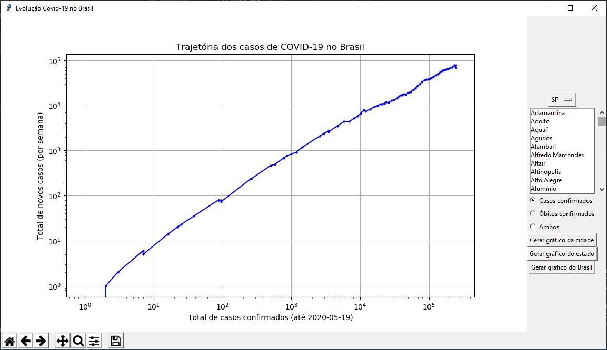
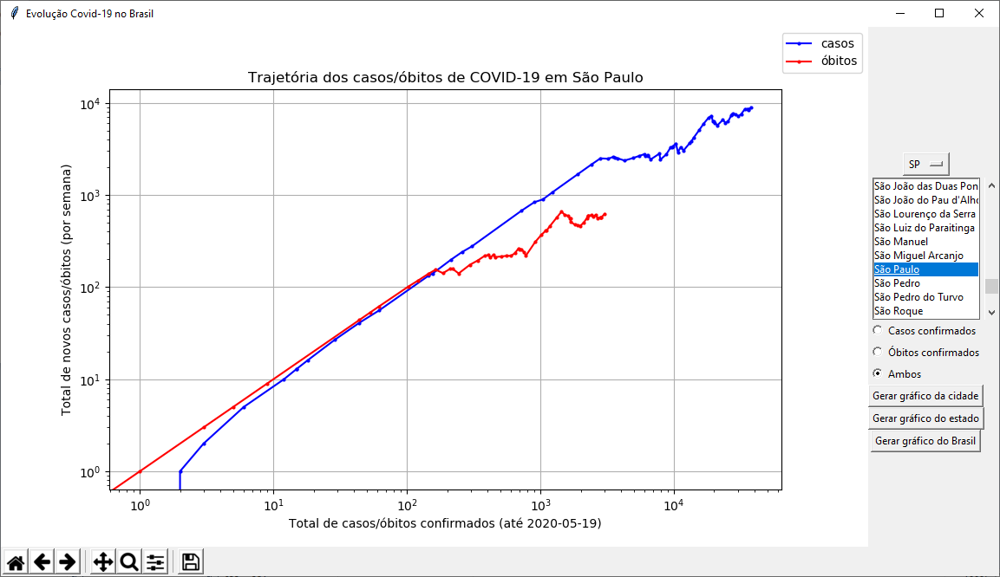
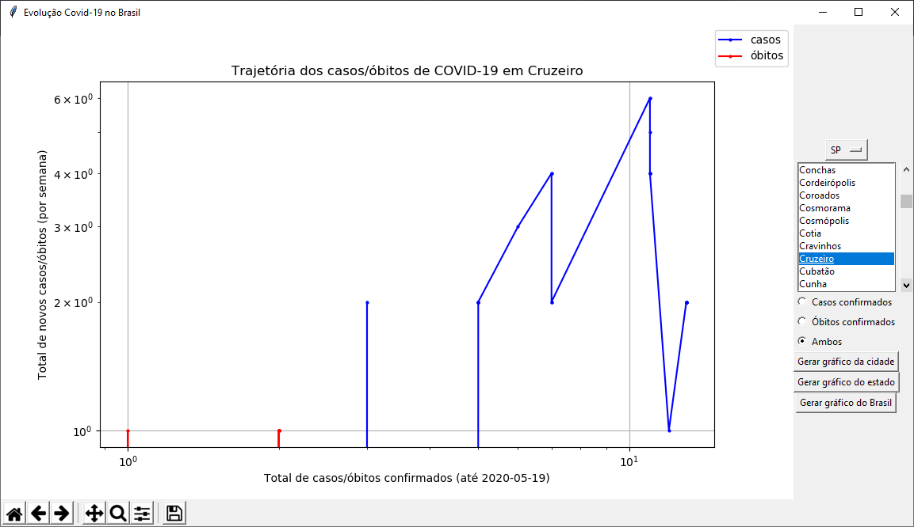

# Trajetória Covid-19 - cidades do Brasil
Acompanhamento da trajetória dos casos do Covid-19 por cidade brasileira individual usando a metodologia de Aatish Bhatia (https://aatishb.com/covidtrends/)

O site não mostra os casos no Brasil por estado, muito menos por cidade. Tive a ideia inicial de fazer para o estado de São Paulo usando um repositório oficial de dados - o projeto ainda está no ar em: https://github.com/rafaelmmoreira/Trajet-ria-do-Covid-19---S-o-Paulo

Mas após encontrar os dados excelentes do https://brasil.io/home/ resolvi expandir a ideia original.

## Sobre a metodologia:
É difícil visualizar tendências de desaceleração quando estamos no meio da curva exponencial. Portanto, o método proposto utiliza um gráfico relacionando o número total de casos x número de casos novos. Os casos novos são agrupados por grupos de 7 dias para desprezar ruídos de variação diária e tornar o gráfico mais nítido, e os eixos são logarítmicos.

Durante o período de crescimento exponencial, o gráfico aproxima-se bastante de uma reta crescente. Conforme a doença desacelera, mesmo que seja uma tendência sutil de achatamento na curva exponencial original, este gráfico vai mostrar a reta curvando-se para a horizontal, e quando os casos começarem a cair, a reta tornará-se decrescente. Vale à pena ver os gráficos de alguns países diferentes no site original para entender melhor o gráfico. Também recomendo muito assistir o vídeo do canal minutephysics a respeito (https://www.youtube.com/watch?v=54XLXg4fYsc).

 Gráfico agrupando dados do Brasil todo  

 Gráfico agrupando dados do Estado de São Paulo  

 Gráfico da cidade de São Paulo  

É importante notar que temos algumas limitações:

* 1) Gráficos logarítmicos distorcem os dados: uma pequena oscilação na taxa de crescimento da curva exponencial (aquela que aparece nas notícias) causará uma grande variação neste gráfico. Portanto, este gráfico é útil para mostrar tendências, não quantidades absolutas.

* 2) Em cidades muito pequenas ou onde o monitoramento começou recentemente, há poucos casos - e mais importante, poucos casos novos por semana, o que seria equivalente a ruído estatístico, o que compromete bastante a visualização da tendência. Veja abaixo o gráfico de uma cidade do interior (Cruzeiro - SP). Na data de geração deste gráfico (19/05/2020, com dados até o dia 18), a cidade estava chegando na primeira dezena de casos. Além disso, houve um período de alguns dias sem casos novos e de repente 2 casos novos foram notificados, o que nessa escala do gráfico provoca o efeito visual de descontinuidade da curva.

* 3) O programa usa dados oficiais para gerar o gráfico. É sabido que há uma grande quantidade de subnotificação de casos por falta de testes (https://drive.google.com/file/d/1_whlqZnGgvqHuWCG4-JyiL2X9WXpZAe3/view, https://covid19br.github.io/informacoes.html).

 Gráfico da cidade de Cruzeiro-SP  

Em suma, esse programa é apenas (mais) uma ferramenta para visualizar as tendências dos dados oficiais no Brasil.

Se você é pesquisador, sinta-se à vontade para se modificar ou se inspirar nesse código para fazer outras análises ou estudar outras regiões.

Se você não é pesquisador, evite tirar e espalhar as suas próprias conclusões e confie nos pesquisadores! :)
